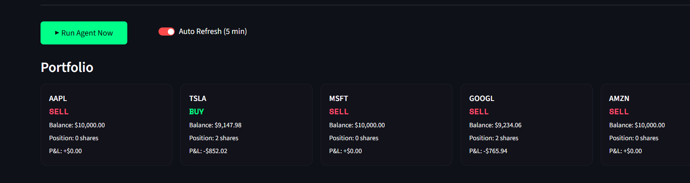
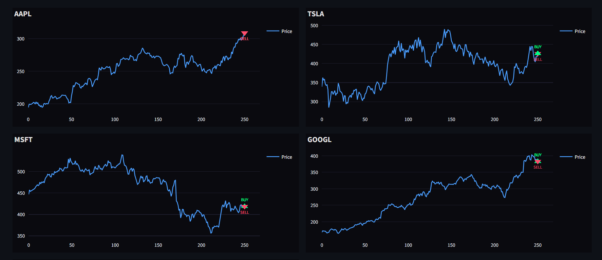
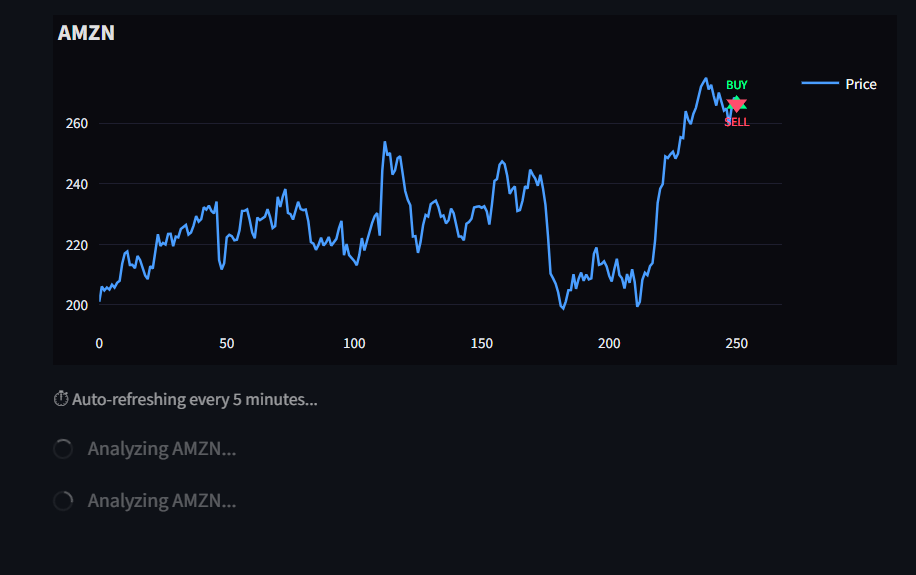

# AI STOCK TRADING AGENT

A multi-agent stock trading system that autonomously makes 
BUY / SELL / HOLD decisions using LLM reasoning + technical 
indicators + real-time news sentiment.

## Dashboard

  

## Charts

  

  

## How it works
- **get_data** — fetches 1 year of OHLCV price data from Yahoo Finance
- **get_indicators** — computes RSI, EMA, VWAP, ATR
- **get_news** — fetches latest financial headlines
- **get_sentiment** — LLM scores news sentiment
- **trading_model** — Llama 3.3 70B reasons over all signals and decides to buy/sell/hold stock

## Tech Stack
- LangGraph — agent orchestration
- LangChain + Groq — LLM inference
- yfinance — market data
- feedparser — news data 
- Streamlit + Plotly — dashboard